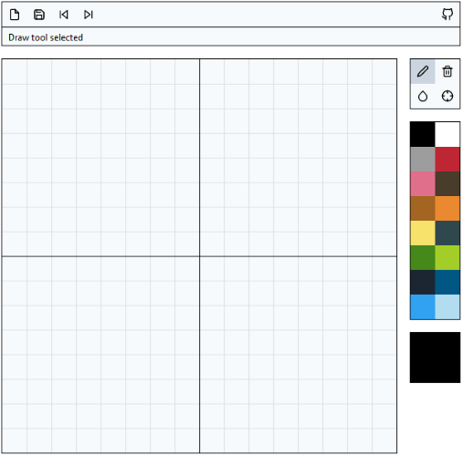

# Sprunk

**Sprunk** is a minimalist pixel art editor built using [Mithril].



A demo is available [here].

[Mithril]: https://mithril.js.org/
[here]: https://beta7.io/sprunk.html

## Quickstart

Check out the repository and install all dependencies:

```bash
$ git clone https://github.com/jessebraham/sprunk.git
$ cd sprunk/
$ npm install
```

The development server can be run via:

```bash
$ npm run start
```

The application can then be accessed at [http://localhost:8080/](http://localhost:8080/).

To build, run either of the following:

```bash
$ npm run dev  # development
$ npm run prod # production
```
